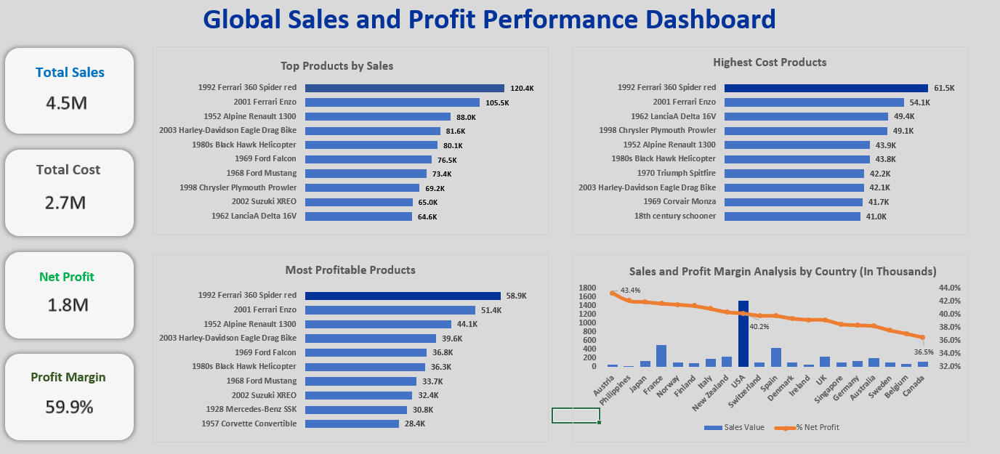
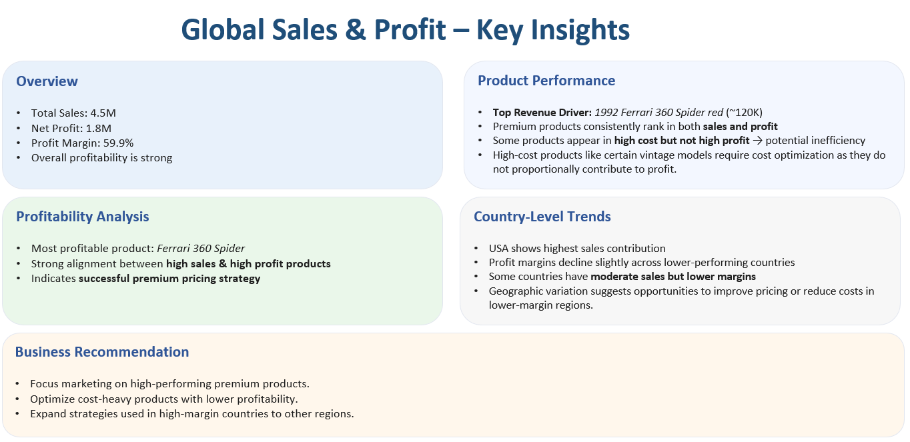
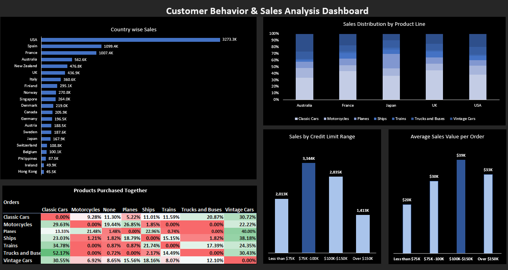
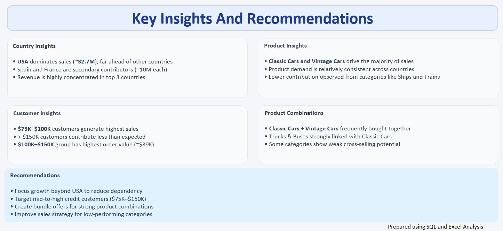

# 📊 Global Sales & Customer Behavior Analysis

End-to-end sales and customer behavior analysis using **SQL and Excel dashboards** to uncover profitability, trends, and business insights.

---

## 🔍 Project Overview

This project analyzes:

* Sales performance
* Product profitability
* Customer purchasing behavior

Key focus areas:

* High-performing products
* Profitability drivers
* Customer segments
* Cross-selling opportunities

---

## 🛠️ Tools Used

* SQL (Data extraction & transformation)
* Excel (Pivot Tables, Dashboards, Visualization)

---

## 📁 Project Structure

* `/data` → Raw dataset
* `/sql` → SQL queries
* `/dashboard` → Excel dashboards
* `/images` → Dashboard screenshots

---

# 📊 Sales & Profit Analysis

## Dashboard

## Key Insights

---

# 👥 Customer Behavior Analysis

## Dashboard

## Key Insights

---

## 🧠 Key Techniques Used

* Data cleaning using SQL
* Aggregation and segmentation
* Market basket analysis
* Dashboard storytelling

---

## 📌 Conclusion

This project demonstrates how raw data can be transformed into actionable business insights using SQL and Excel.

---

**Prepared by: Shravani D**
